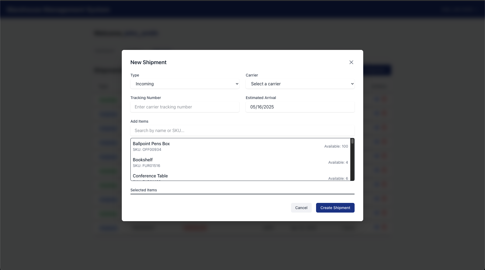

# System Overview

This document provides an overview of the features of this Warehouse Management System

## Front-end

The front-end is powered with React

### Register

The registration page allows new users to create an account in the system. Users need to create a username and  password to access the system.

### Login

The login page provides secure access to the system. Users can enter their user name and password to access their account and the warehouse management features.

### Dashboard

The dashboard provides a comprehensive overview of the warehouse's current status. It displays key metrics including:
- Total inventory items
- Outstanding shipments
- Low Stock Alerts
    - When an item slips below it's minimum stock, an alert will be displayed on the dashboard, indicating that this item is low stock and need to be restocked.

### Inventory

The inventory management section allows users to manage all warehouse items.

#### Managing Inventory

The main inventory section allows users to view, update, and delete all inventory

#### Adding Inventory Items

Users can add new inventory items by providing:
- Item name
- SKU (unique identifier)
- Category
- Location
- Quantity
- Minimum stock level
- Description

#### Viewing Inventory Item Shipment History

Each inventory item has a detailed view showing a graph of the items stock overtime as well as a list of shipments that contain this item.

### Shipments

The shipments section manages all incoming and outgoing shipments.

#### Managing Shipments

The shipment management interface allows users to:
- View all shipments
- Track shipment status
- Update delivery information
- View shipment details

#### Creating a new Shipment

Users can create new shipments by:
- Selecting shipment type
    - Incoming shipments are shipments coming to the warehouse
    - Outgoing shipments are shipments leaving the warehouse
- Setting carrier information
- Entering a Tracking Number
- Adding items and quantities
    - A user can search and select items that are included in the shipment
    - Once items are selected, a quantity can be added for each item
    - A unit price for each item can be entered

## Backend

The system is powered by a Django REST API backend.

### Home Page

The backend provides a user-friendly home page that changes based on authentication status.

#### Unauthorized

When a user is not authenticated, they see a welcome message and basic API information, along with options to log in or view API documentation.

#### Authorized

After logging in, authenticated users see additional system statistics and have access to the admin panel and logout options.

### Documentation

The API documentation is available in two formats:

#### Swagger

Swagger UI provides an interactive API documentation interface where users can:
- View all available endpoints
- Test API calls directly from the browser
- See request/response schemas
- Authenticate to test protected endpoints

#### Redoc

ReDoc provides a more readable, user-friendly documentation format that:
- Organizes endpoints by category
- Provides detailed schema information
- Offers a clean, modern interface
- Includes authentication information

